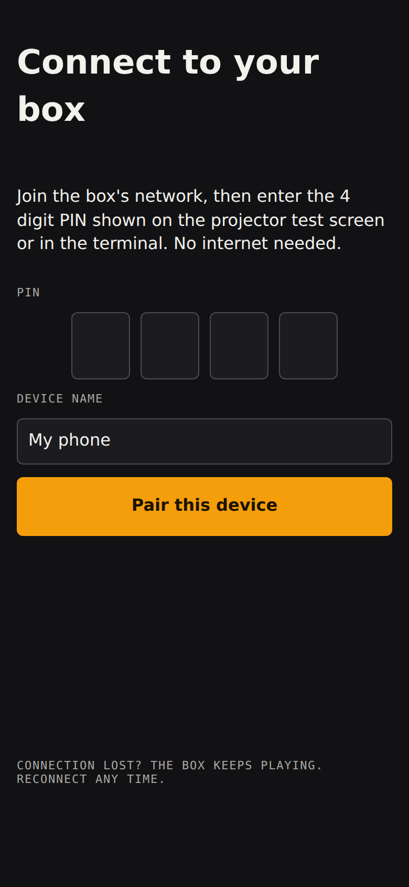
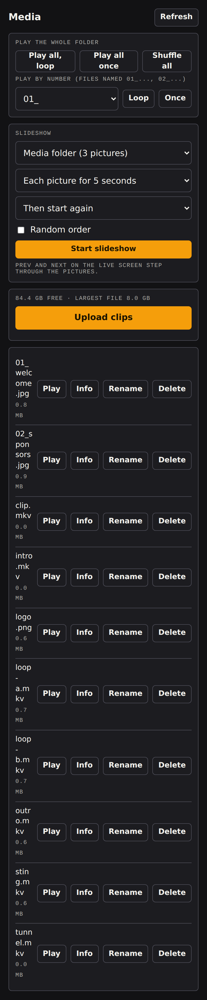
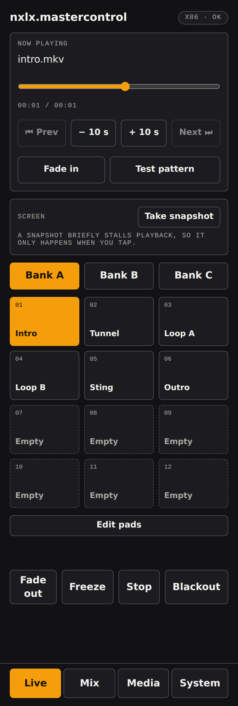
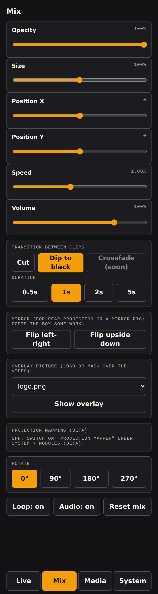
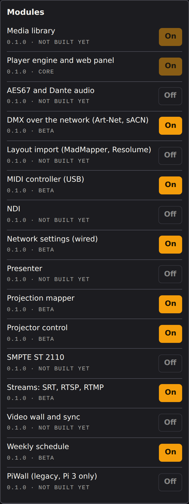

<!-- SPDX-FileCopyrightText: 2026 NXLX.Systems and contributors
     SPDX-License-Identifier: Apache-2.0 -->
# nxlx.mastercontrol: user manual

For the person running visuals at a gig. It covers the new Python panel (the `pvj/` folder). The old PHP panel for the legacy Pi 3 line has its own manual in `docs/html`.

**Status, read this first.** The new core has been built and tested in containers and CI, and the image has been booted and used on **one Raspberry Pi 4** (what was and was not verified there is listed in [HANDOFF.md](../HANDOFF.md)). Other boards, a projector, and several features (MIDI Learn, streams, the read-only root, the Network module) have not been tried on hardware. Where this manual describes them, that is what the code is written to do. Treat anything not listed as verified as untested on hardware, and do not use it at a paid show without a rehearsal and a backup plan. The checklist is in [tools/DEVICE-TESTING.md](../tools/DEVICE-TESTING.md).

The pictures come from the test suite (test clips and a fake network), see [UI.md](UI.md).

## 1. Get it running

**With the image.** Download the `nxlx-mastercontrol-image` artifact from the "Build image" workflow (Actions tab), check it against `SHA256SUMS`, and flash the `.img.xz` with Raspberry Pi Imager ("Use custom"). The image has **no password and SSH is off**: the first boot asks for a user name and password on the Pi's own screen and keyboard. (For a headless first boot see "Option C" in [tools/DEVICE-TESTING.md](../tools/DEVICE-TESTING.md).)

**On an existing system** (Raspberry Pi OS Bookworm or Trixie, Debian, Ubuntu): `sudo install/install.sh`. See [install/README.md](../install/README.md).

The web panel listens on port 80. Connect the box and your phone to the same network. A direct Ethernet cable between a laptop and the box also works (the network module has a "Direct cable" mode for that).

## 2. Pair your phone

Open `http://<address of the box>/` in a browser. The box makes a new four digit PIN every time it starts. Until the first device has paired, the box draws the PIN and its address on its own screen whenever nothing is playing; after that it never appears on screen again, so it cannot show at a gig. You can always read it with `sudo pvj-pin`, and any full-access device can make a new PIN or a guest link in System.

A paired phone is remembered until you remove it. A wrong PIN is throttled. If someone locks new pairing by guessing, a paired full-access device clears it with **New PIN** in System.

There are three access levels: **view** (look only), **live** (play and mix) and **full** (change pads, modules, files and settings). Make a guest link for a friend in System > Access; it shows once.

## 3. Put clips on it

Media > **Upload clips** (full access). Video and image files only. Uploads go to a hidden temporary file and appear only when complete, so a dropped connection never leaves a half file. Or plug in a USB drive: it mounts read-only under `/media/pvj/<label>` (and `/media/usb` for the newest one), and its video and image files at the top level of the drive appear on the Media screen under "USB drive" with a **Play** button, so you can play straight from the stick without copying (a 3 GB film played fine this way on a Pi 4). Files in folders on the drive are not listed yet; put the clips at the top.

Clips live in `/var/lib/pvj/video`. **If you turn on the read-only root (`sudo pvj-rootfs enable`), move media to a second disk or USB drive first**: everything on the system disk is lost at reboot afterwards, and the command refuses if media is on the system disk.

## 4. Play

**Live** has three banks of twelve pads. **Edit pads** (full access) assigns a clip to a pad. Tap a pad to play it. **Fade out**, **Freeze** (pause) and **Blackout** are always at the bottom.

**Screen** (Live, under Now playing): tap **Take snapshot** to see what the box is putting on the display. It is a screenshot of the player's own output, so a blackout, brightness or size change shows up. It is a single picture on request, not a live view, and it is deliberately not automatic: on a Raspberry Pi 4 each snapshot stalls playback for about a quarter of a second (measured: a continuous preview made video visibly choppy). Any paired device may take one, including view-only guests. For a real-time picture use an HDMI capture device on the display's output.

**Sound output** (System): on a Raspberry Pi "Automatic" sends the sound to the HDMI port that has the screen on it (the player's own default is the 3.5 mm headphone jack, which is silent on a monitor). Pick another output, such as the headphones or a USB sound device, in System > Sound output. The choice is remembered and re-applied if the player restarts.

**Mix** has opacity, size, position, speed, rotate, loop and mute, and how one clip changes to the next: **Cut** or **Dip to black** (a real crossfade is not built; it needs a second player).

## 5. Optional modules (System)

Beta modules are **off** until you switch them on under System > Modules. Modules that are not built yet say "Not built yet".

| What | Where to read |
| --- | --- |
| **Autostart**: what plays at power-up and after a crash | [pvj/AUTOSTART.md](../pvj/AUTOSTART.md) |
| **Weekly schedule**: play, stop, blackout or show at set times | [pvj/SCHEDULE.md](../pvj/SCHEDULE.md) |
| **Streams**: SRT, RTSP, RTMP | [pvj/STREAMS.md](../pvj/STREAMS.md) |
| **DMX over the network**: Art-Net and sACN | [pvj/DMX.md](../pvj/DMX.md) |
| **MIDI controller** (USB) | [pvj/MIDI.md](../pvj/MIDI.md) |
| **OSC**: TouchOSC, Resolume, QLab and others | [pvj/OSC.md](../pvj/OSC.md) |
| **Network settings** (wired) | [pvj/NETWORK.md](../pvj/NETWORK.md) |

Check the box clock before relying on the schedule: a Pi has no battery clock, and until the network sets the time the clock is wrong.

## 6. Keep it safe and recoverable

- **Keep the show network private.** The panel is protected by a PIN and per-device tokens, but it is not built to face the internet. OSC, DMX and MIDI are off until you switch them on; OSC and DMX only accept senders on private networks (plus ranges you add).
- **Power cuts.** The read-only root protects the system disk from a pulled plug (`sudo pvj-rootfs enable`, then reboot). Not tested on a real board.
- **Updates** are signed bundles installed with `sudo pvj-update` (from a USB stick, no internet needed) and roll back by themselves if the panel does not come back. See [pvj/README.md](../pvj/README.md#updates-and-rollback). There is no update button in the panel.
- **Player stuck?** System > Restart player asks it to quit and systemd brings it back. If mpv ignores that, run `sudo systemctl restart pvj-player` on the box.
- **Network changes** always revert by themselves unless you confirm them. Test them with a keyboard and monitor on the box, never over SSH on the only link.

## 7. Troubleshooting

| Symptom | Try |
| --- | --- |
| The page does not load | Same network as the box? `systemctl status pvj-web` on the box; the address may have changed (check the router's client list) |
| "Wrong PIN" | The PIN changes at every start. `sudo pvj-pin`, or System > New PIN from a paired device |
| A pad is grey and says Empty | Edit pads (full access) and assign a clip |
| Clip will not play | Check the file plays in `mpv` on the box; on a Pi 5 use HEVC (no hardware H.264 decode) |
| Nothing shows on the projector | `pvj-selftest --play` on the box; check `journalctl -u pvj-player` |
| DMX or MIDI does nothing | The module must be on **and** the card turned on; read the card's status line and `journalctl -u pvj-web` |
| Schedule fires at the wrong time | Check the box clock shown on the Schedule card and the time zone |

## 8. Not built yet

Crossfade, Wi-Fi and hotspot, updates from the network, a panel update button, shutdown and reboot buttons, NDI, AES67/Dante, ST 2110, the mapper, the presenter, the video wall, projector control, MIDI learn and custom DMX layouts. See [ROADMAP.md](../ROADMAP.md).
