<!-- SPDX-FileCopyrightText: 2026 NXLX.Systems and contributors
     SPDX-License-Identifier: Apache-2.0 -->
# The panel

The pictures on this page are made by `tests/ui/screenshots.js`, which drives the real panel against the same test harness as the browser test: a headless player, two-second test clips and a **fake network helper**. So the clip names, the addresses (`192.168.1.9`, `192.168.0.40`) and the network ports shown are made up for the picture; nothing here was taken from a real board. Regenerate them with:

```
SHOTS=docs/images/ui node tests/ui/screenshots.js     # needs playwright, Chromium and mpv, like tests/ui/panel.test.js
```

The CI job "panel-ui" also runs it and uploads the result as the `ui-screenshots` artifact, so a change that breaks a screen shows up there.

## Pairing

Enter the four digit PIN shown on the box (`sudo pvj-pin`, or the projector test screen). A device is remembered until it is removed.


## Live

Twelve pads per bank, three banks. The pad that is playing is lit. Fade out, Freeze and Blackout are always at the bottom.


The wide layout on a laptop or tablet, and one of the four themes (Dark stage is the default; Night red keeps a dark room dark):

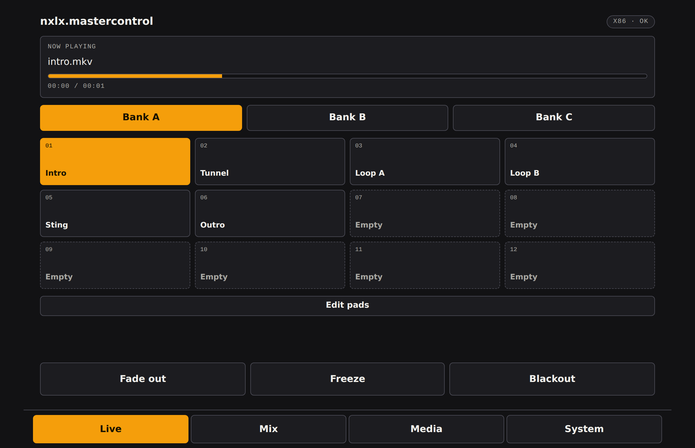
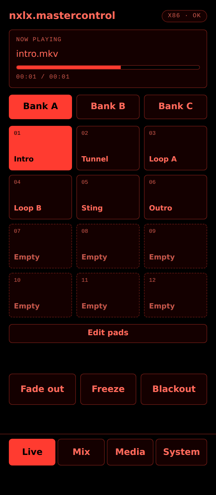

## Mix


## Media

Upload from the phone, play, rename or delete. Only full-access devices can change files.


## System

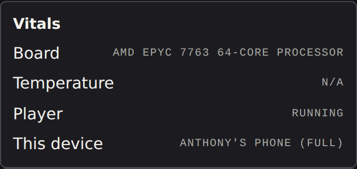

Modules are switched on here. Beta modules are off until you turn them on; modules that are not built yet say so.


### Beta modules

| Weekly schedule (see [SCHEDULE.md](../pvj/SCHEDULE.md)) | Streams (see [STREAMS.md](../pvj/STREAMS.md)) |
| --- | --- |
| 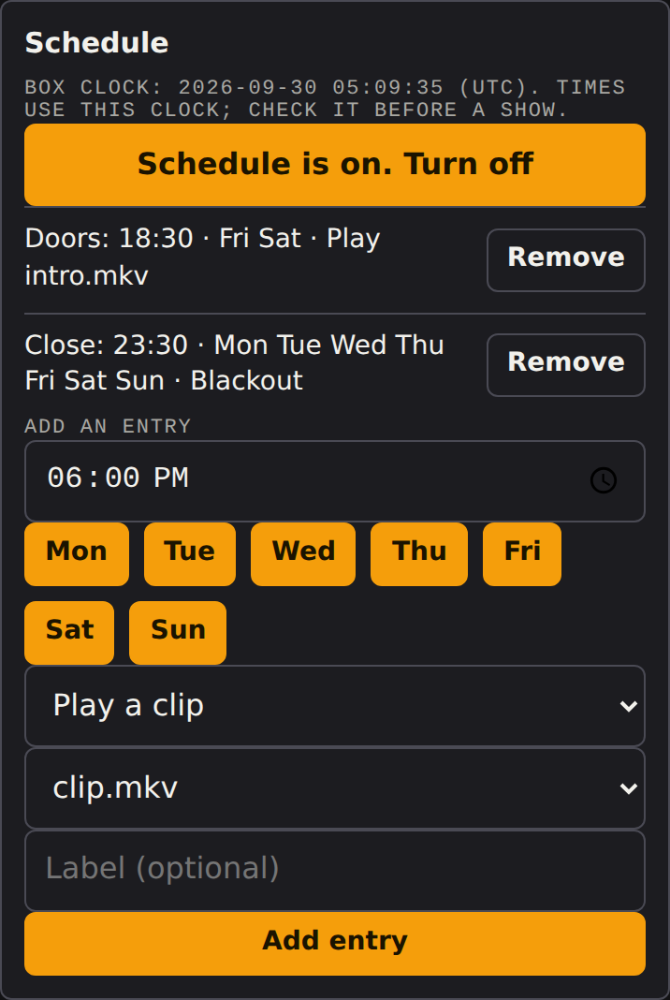 | 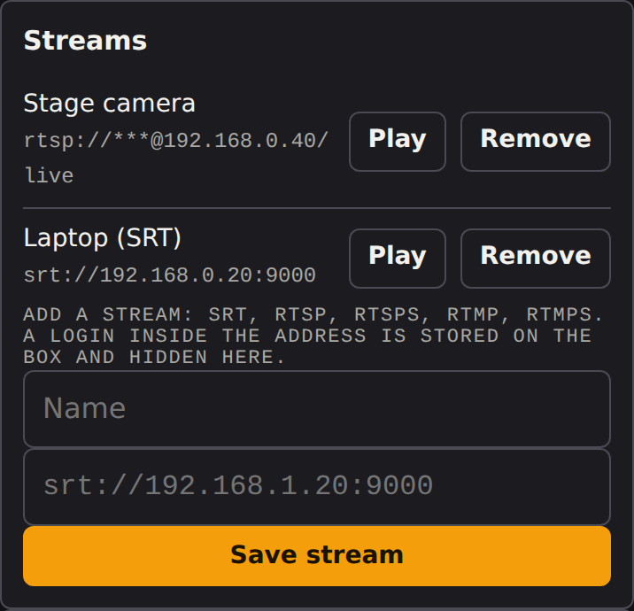 |

| DMX (see [DMX.md](../pvj/DMX.md)) | MIDI (see [MIDI.md](../pvj/MIDI.md)) |
| --- | --- |
| 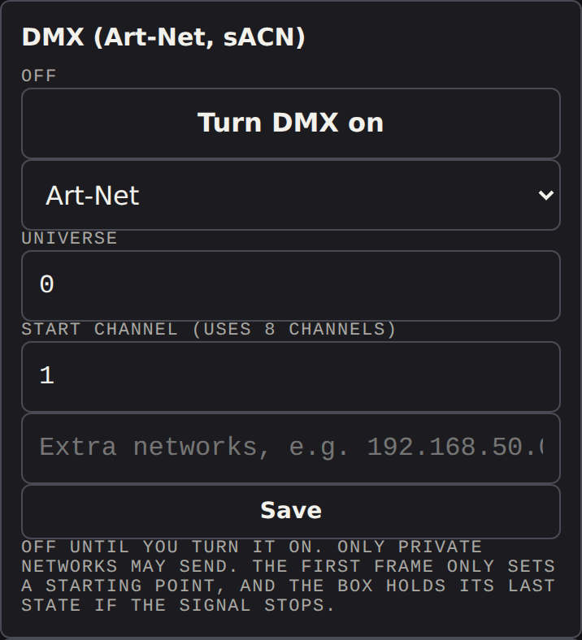 | 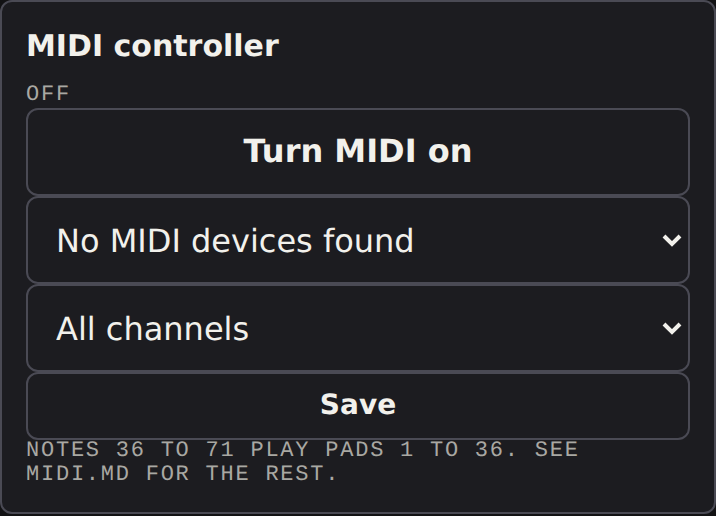 |

Network settings (wired) always revert by themselves unless you confirm them. See [NETWORK.md](../pvj/NETWORK.md).

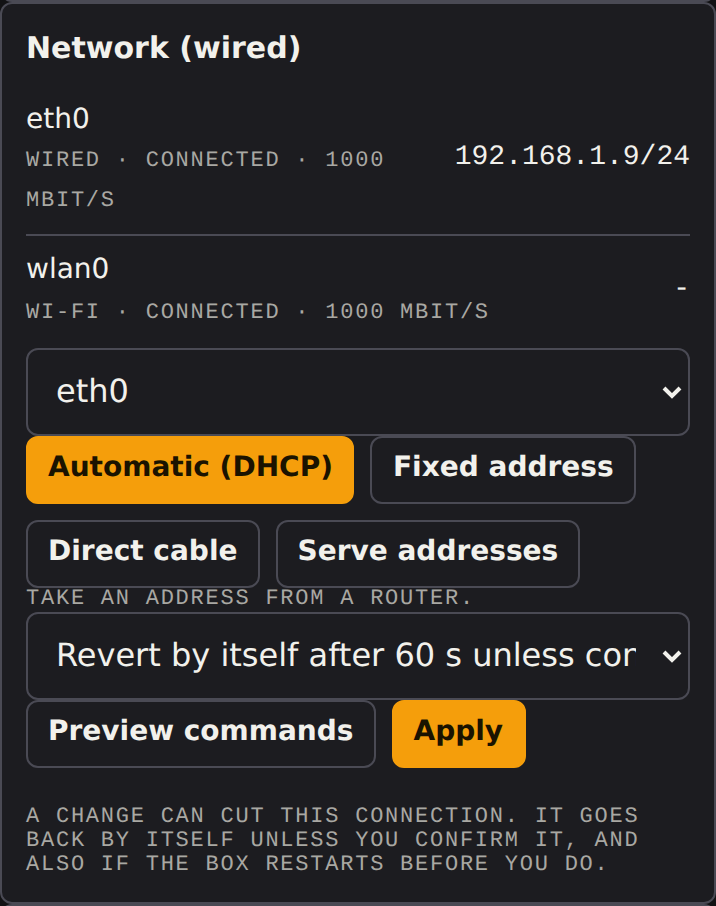

### Control, appearance and access

| OSC (see [OSC.md](../pvj/OSC.md)) | Appearance | Access |
| --- | --- | --- |
| 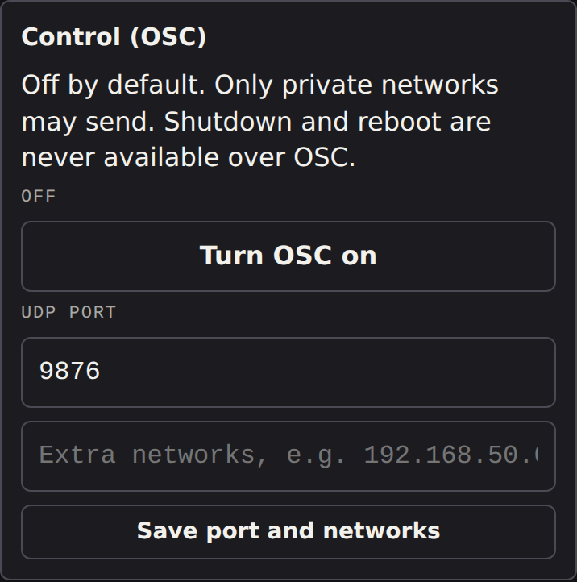 | 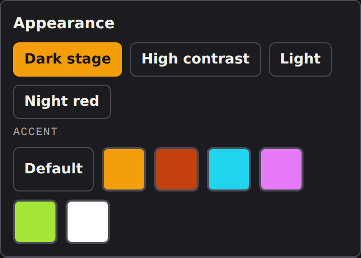 | 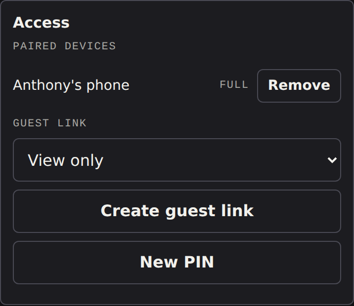 |
